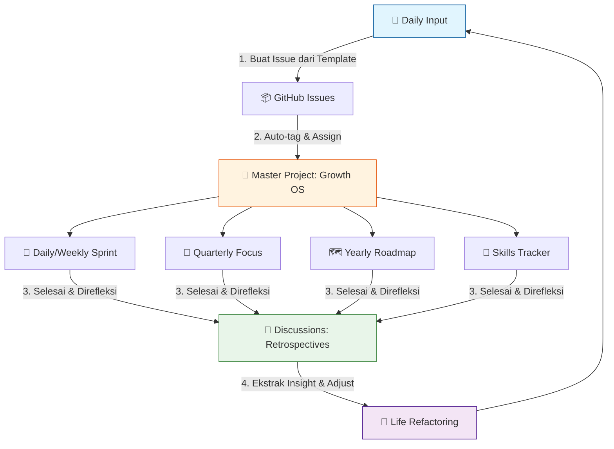

# `life.dotdev`

> 🚀 Life in development mode. Documenting my growth as a programmer — skills, habits, and goals. One commit at a time.

## 🧠 System Architecture
Repository ini bukan jurnal pasif. Ini adalah **environment pengembangan diri aktif** yang dirancang untuk meminimalkan gesekan input dan memaksimalkan akuntabilitas output.



## 📂 Repository Structure
```
life.dotdev/
├── .github/
│   ├── ISSUE_TEMPLATE/       # Form input standar (wajib konsisten)
│   │   ├── daily-log.md
│   │   └── milestone.md
│   └── DISCUSSION_TEMPLATE/  # Form review berkala
│       └── weekly-retro.md
├── docs/
│   ├── yearly-roadmap.md     # North Star & target tahunan
│   └── skill-matrix.md       # Matriks hard/soft skill + level
├── journals/                 # Backup opsional (markdown offline)
└── README.md                 # Dokumentasi sistem ini
```

## 🛠️ How The Loop Works
| Siklus | Aksi | Fitur GitHub | Output yang Diharapkan |
|--------|------|--------------|------------------------|
| **Harian** | Catat progres, hambatan, insight | `Issues` + template `daily-log` | Task tercatat, history commit |
| **Mingguan** | Tutup issue, evaluasi pola | `Projects` (Sprint View) + `Discussions` | Board bersih, lesson learned |
| **Kuartal** | Assess gap skill, adjust target | `Projects` (Focus View) | Roadmap diperbarui, sprint terfokus |
| **Tahunan** | Retrospektif, refactor sistem | `docs/yearly-roadmap.md` | Arsitektur tahun depan |

## 🛡️ System Integrity Rules (Anti-Failure Protocol)
*Berdasarkan analisis gesekan kognitif. Abaikan ini, dan repo ini akan menjadi kuburan digital dalam 60 hari.*

1. **⏱️ Aturan 5 Menit:** Jika logging butuh >5 menit, Anda over-engineering. Gunakan bullet point. *Done > Perfect.*
2. **🚫 Dilarang Issue Yatim:** Setiap issue harus terhubung ke milestone atau goal kuartalan. Jika tidak punya kaitan jelas, hapus atau arsipkan.
3. **🔄 Review > Record:** Nilai sistem bukan di seberapa banyak Anda menulis, tapi seberapa rutin Anda mereview. Retrospektif mingguan adalah *non-negotiable*.
4. **📦 Single Source of Truth:** Hanya **satu** Project Board (`Growth OS`), gunakan multiple views. Jangan fragmentasi ke beberapa project.
5. **🎯 Track Outcome, Bukan Aktivitas:** `"Baca 50 halaman"` < `"Bisa jelaskan konsep X ke junior dev"`. Fokus pada hasil terukur.

## 🚀 Quick Start
1. Buat issue pertama dari template `daily-log.md`
2. Commit. Push. Iterate.

---
*Built by [Lord CodingSkuy](https://github.com/LordCodingSkuy) | Status: `IN DEVELOPMENT` | Last Audit: `2026-04-06`*
```
